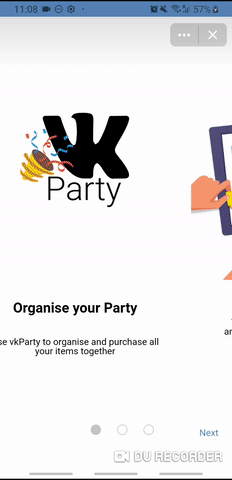

# VKParty

<p align="center">
  <a href="#"></a>
</p>

**We want to revolutionise event planning. VKParty allows VK event planners to engage in social commerce via AliExpress and split the bill with attendees.**

Use VKParty to organise and purchase all your items together. Suggest items, vote on them and have a shared basket for everything.

[Prototype demo](https://www.figma.com/proto/XgmyQOAxSGradREp7r86iz/VKParty?node-id=86%3A248&scaling=scale-down)

[VK Mini-app](https://vk.com/app7210223)

[Junction Submission](https://app.hackjunction.com/projects/junction-2019/view/5dcf176c62c4f1002bdd4bfb)

## How to install

`npx @vkontakte/create-vk-app <folder name>`

## How to start

First enforce http:

On windows:

```cmd
set HTTPS=true
```

or on Linux/MacOS:

```bash
export HTTPS=true
```

Go to created folder and run:
`yarn start` || `npm start` — this will start dev server with hot reload on `localhost:10888`.

`yarn run build` || `npm run build` — this will build production bundle, with treeshaking, uglify and all this modern fancy stuff
